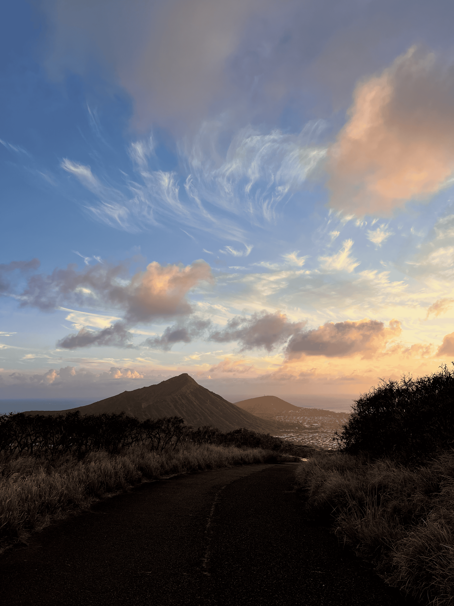

# About

I grew up on Oʻahu, surrounded by nature that inspired my passion for caring for the environment. My first, somewhat-of-an-introduction to computers and coding came in middle school through Minecraft console commands (even if a lot of it was switching to Creative Mode if I was close to dying). But still there were other cool commands and mods that sparked a curiosity for how things work and how I could tinker them to my liking. That love of learning carried into high school, where I started learning calculus and physics. Even though they were challenging, I found beauty in the complexity and I was lucky to have teachers whose enthusiasm matched my own.

Initially, I considered going into medicine and spent time learning about the human body. But an AP Environmental Science class changed my course and I realized this field was just as fascinating and impactful. I went on to earn a B.S. in Global Environmental Science from the University of Hawaiʻi at Mānoa, where I gained a deeper understanding of environmental systems, data, and coding. Again, because of my great advisors and other teachers, I've become fascinated by the complex and growing field of Environmental Data Science. In the near future, I'm very excited to utilize data insights to help solve environmental problems.

## Hobbies

-   Surfing, I learned how during the COVID-19 pandemic when there wasn't much to do. I started on a longboard as most do but as I got better and learned my style, I've concluded I prefer longboarding. Though I do own a small twin-fin fish that I attempt to take out sometimes. My favorite place to surf is Ala Moana, Oʻahu.

- Gaming, mostly PC games but I've clocked a good bit of Nintendo DS hours as well. Some notable PC games that I've liked are: Minecraft, Team Fortress 2, Apex Legends, Valorant, No Man's Sky, Stardew Valley, and Helldivers 2.

-   Music, listening and making. I've played percussion instruments from middle-school to college, with a preference towards marching percussion. I also dabble in drumset, mostly playing at college volleyball & basketball games. I even had the opportunity to play drumset in my friend's band for a small event during Summer 2025! Check out [TCKR's Spotify](https://open.spotify.com/artist/2aZDOwvvOwdS7ufMB0umzd?si=s6wlKnyrT2e-9LpwOiLY7w)!

-   Reading, currently reading The Jade City by Fonda Lee but my favorite is The Dragon Republic, Book Two in R.F. Kuang's The Poppy War Trilogy.

-   Anime, I believe that some of the best works of fiction are anime. I'm currently on 86 - Eighty Six - but my favorite of all time is Attack on Titan. Some others I like are: The Apothecary Diaries, Kaguya-sama: Love is War, Sakamoto Days, and Frieren: Beyond Journey's End.

-   日本語の勉強, inspired by my sister who lives in Japan, I wanted to learn Japanese to connect with her in another language. I started around May 2024 and I'm teaching myself!

## Fun Facts

-   I have a twin sister!

-   I also know *some* ʻŌlelo Hawaiʻi (Hawaiian language).

-   My favorite Pokémon are: Luxray, Espeon, Empoleon, & Garchomp
