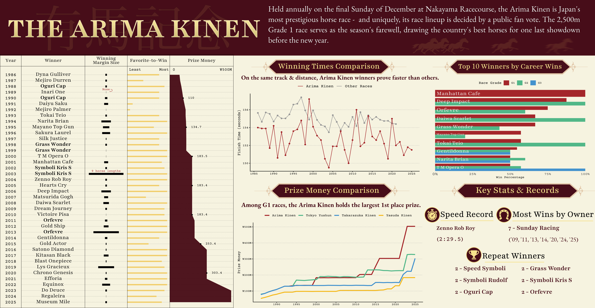
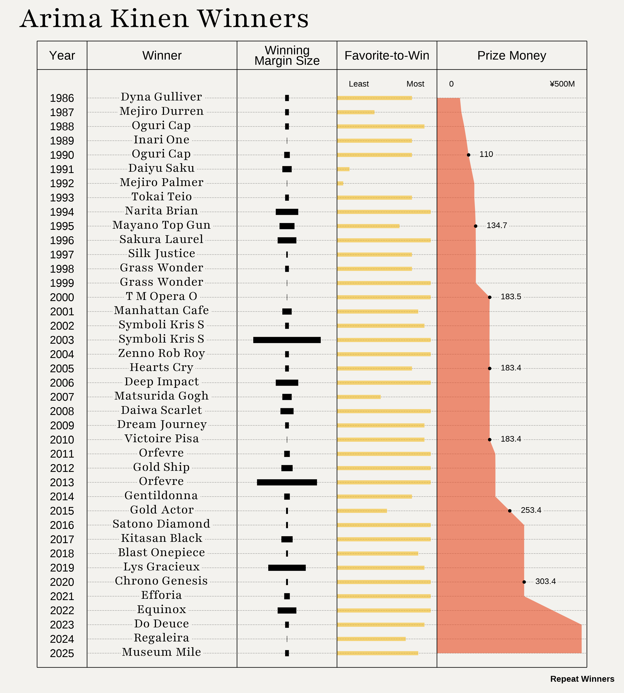
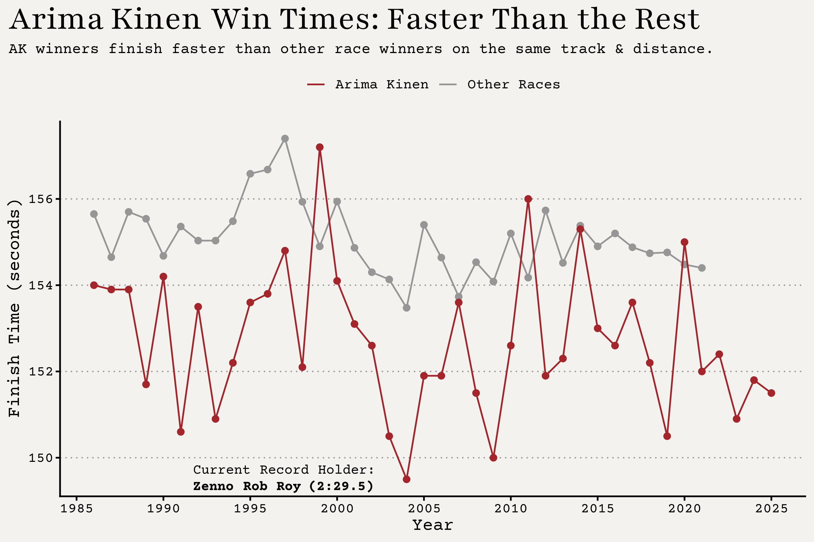
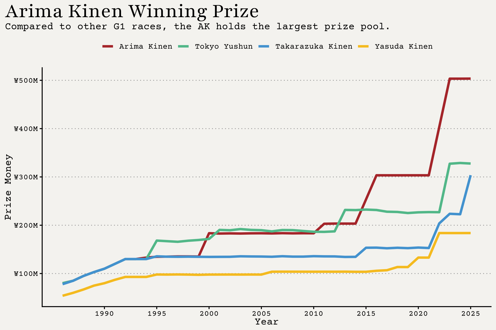
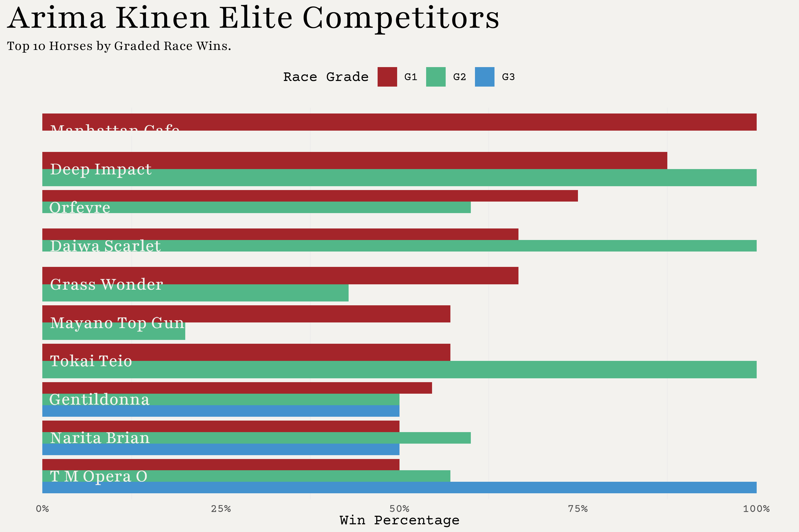
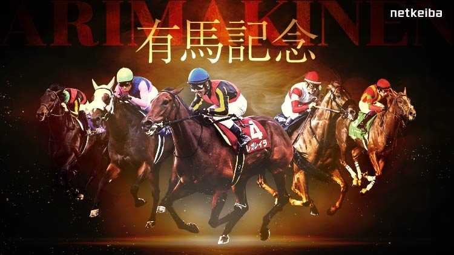
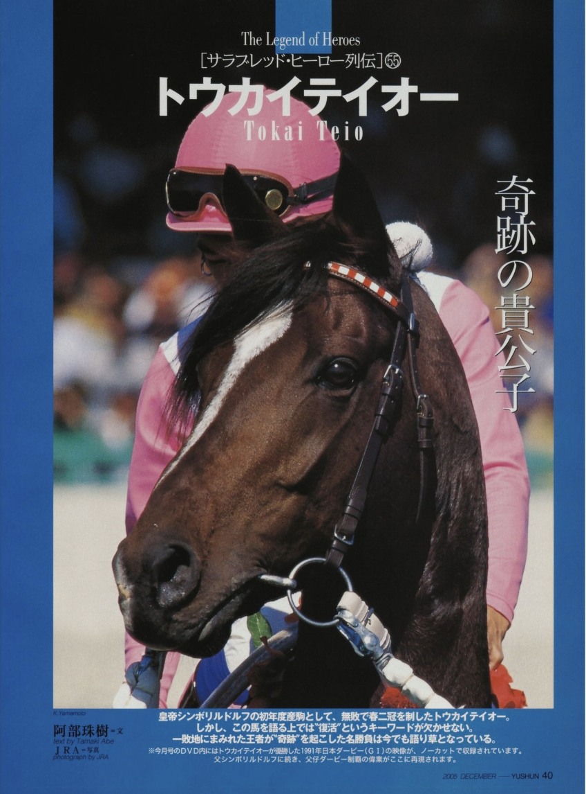

# Background

What drives you to acheive your dreams? Does your motivation come from your own spirit? Public expectation? A rival competitor? If you're a racehorse, it may be all three! Japan's popular multi-media franchise, *Umamusume: Pretty Derby*, has infiltrated global pop culture and has recently exploded in its international fanbase. The fictional universe centers around "Umamusume", a species of anthropomorphized racehorses that co-exist with human society and compete in races. These characters are based on real-life Japanese racehorses, reflecting each horse's racing careers, personality, and relationships with other horses. The anime follows a few, main character horses whose career is turned into a captivating story and you can't help but become immersed in the world of horse racing. Inspired by these stories and my recent trip to Japan where I went to an actual horse race, I wanted to search for a dataset that contained horse races in Japan.

# Data

Horse race data was sourced from [netkeiba](https://www.netkeiba.com/), a website that hosts official Japan Racing Association (JRA) data. This was done by a user on Kaggle, an online data science community where users can find datasets to work with or publish their own. The user who published this horse racing data used web-scraping tools to assimilate the race results data used in this project. 

# Approach

After exploring the data, I thought it was best to focus my infographic on one highly regarded race: The Arima Kinen, Japan's Grand Prix. This race takes place every year in December and is one of two "All-Star" races that occur annually. Additionally, horse racing fans are able to vote which horses they want to race, resulting in high expectations and large winnings to lucky bettors. I wanted to have my infographic centered around the winners and highlight certain aspects of this high-level of racing.

# Infographic

To see the image better, right-click the image, and "Open Image in New Tab" to open in a new tab.



# Visualizations

## Winners Chart

**Who are the race's winners, how much length did they win by, were they expected to win, how much was the first place prize?**

My first goal was to create some chart of a winner's list. I initially had no idea how I'd want this to look or accomplish with code. One way to get inspiration? Tidytuesday. Each week, the Data Science Learning Community publishes a new dataset to their GitHub repository and invites anyone to create and share their own visualization. Georgios Karamanis is a awesome data viz creator recommended by our class instructors to pull inspiration from. While going through his tidytuesday submissions, in 2020, the dataset was also on a race, the Tour de France, and his submission was a great piece to adapt into the race I'm doing. Essentially a large summary table, the graphic I made has four columns: year, winning horse name, winning margin, the horse's favorite-to-win rank, and the 1st place prize money. The year and winner name are simple so I'll start with the margin column. The winning margin is the distance between the first place horse and the second place horse, measured in horse lengths. Smaller margins are most common at this level as most races are quite close and large margins, although rare, show dominating wins like in 2003, Symboli Kris S took the win by 9 horse lengths. The next column is the popular rank of the winning horse. This is common to see in racing results where a rank of 1 indicates the favorite-to-win. To make the chart more intuitive, I inverted the ranks so that the favorite has the longest bar, with bar length decreasing as the winner becomes more unexpected. The last column is how much prize money the horse won at their race. I wanted this to reflect and show the increase over time, likely reflecting the increasing popularity of racing over the years. 



## Win Times Chart

**Across races on the same track & distance, how do win times by high-level Arima Kinen horses compare to those from other races?**

This chart provides context on how the Arima Kinen sets the bar high compared to other races. I filtered my data to the same track & distance as the Arima Kinen and aggregated the first place winning times. For the most part, the horses that win the Arima Kinen are faster than winners from other lower level races. 



## Prize Chart

**How do first place prizes compare across different G1 races?**

The Arima Kinen is one of several G1 races held annually, others include the Tokyo Yushun, Takarazuka Kinen, and Yasuda Kinen. This chart highlights how prize money differs even at the highest grade of racing, showing just how much variation exists at the very top.



## Top 10 Horses

**Which horses had the most successful careers? Defined by graded wins.**

To compliment the winners list, I wanted to find some metric to rank the top 10 most successful horses. I chose to use win percentage of G1 races as my metric and there was one horse who won all of their G1 races: 2001 winner, Manhattan Cafe. I also included each horse's win percentage of G2 & G3 races since it's common for horses to enter in lower grades and work their way up. My personal favorite is among this top 10 ranking, Tokai Teio, and is the main character in the *Umamusume* anime's second season.



## Putting It All Together

All plots were initially made in R and then exported in a vectorized format. They were then combined together in Affinity, a graphic design software similar to Adobe Illustrator. I used this software to fine tune my plots, add additional annotations, and the additional key stats sections. Basically anything that would've been a hassle with coding was done in Affinity.

# Design Elements

::: panel-tabset
## Graphic Form

**Graphic Form:** I used a variety of types of graphic forms for my plots. I decided to keep them rather traditional/basic since my goal with this infographic is to inform those who don't know anything about horseracing, a general audience. Using these plots, a lot of comparisons were done like between G1 races and the top 10 horses so I feel that these plots are suited for making those comparisons and seeing those differences.

## Text

**Text:** Most of my text was added in Affinity. In each individual plot, the basic text was handled in R, for axes and legends, but I knew I wanted to get more fancy and creative with the titles, subtitles, and other annotations. For example, creating the fancy title backgrounds was done in Affinity. Having this flexibility with the text made it easier to tie everything together.

## Icons

**Icons:** All icons used were downloaded from the Noun Project, a free,  online collection of vector icons create by real artists. The following icons were used in this project to add to the visual appeal of the infographic.

{width=160px} {width=160px} {width=160px} {width=160px} {width=160px}

## Themes

**Themes:** Like the graphic form type, I chose to keep plot themes simple, nothing crazy, just straightfoward. This included removing some axis titles and only keep major y gridlines for the line charts.

## Colors

**Colors:** I took color inspiration from the following image. I really liked the red and gold color combination and I felt it gives off a prestige feel. The red was used consistently as the main color as well as coloring the 'top-of-the-top' part of each chart. For example, in the prize chart red was used for indicating the Arima Kinen, and in the bar chart red was used to indicate the G1 category. For the gold color, I knew right away that had to be my title color against a red background. Picking the other colors was more of a loose process, I just wanted them to compliment the red. All in all, I thought all the colors work well together especially against the beige background I chose, I think that really ties it all nicely, giving a papery background feel and goes really well with the red.



## Typography

**Typography:** Similar with the colors, I wanted prestige, formal fonts to match the prestigeness of the Arima Kinen. Serif fonts were definitely the way to go so I chose Playfair for my main title and EB Garamond for the title description text. Anything with numbers like axis text needed a monospaced font, I thought Courier Prime was best. Mainly used in the plots themselves, it's a classy look and matches the race feel.

## General Design

**General Design:** I made the infographic with two halves. The left half was the winners list which is a more general plot and the right half were more specific plots, split into four equal sections. My goal was to have the viewer start at the left side, see the winner's list, and then move right to the right half. I also wanted to include a key stats section that focuses on the individual horses a bit more. For the most part, the viewer can choose what they want to look at depending on their level of interest.

## Data Context

**Data Context:** Figuring out how to provide infographic context combined with data context was challenging. The main source of context comes from the description in the title, explaining that this infographic is about one annual race and the horses that won. Many people probably don't know what the Arima Kinen is as it's not a huge international race so I thought this description was essential. Other context was done in short subtitles under a couple plots.

## Message

**Message:** My main message was that the Arima Kinen is Japan's biggest horse race of the year, analagous to a horce racing SuperBowl. My plots help visualize how this race is higher level than others and what sets it apart: the larger prizes and faster horses. There isn't much of a 'so-what' or a call-to-action and I don't think there's a need for one, I just want people to learn a little about this exciting race.

## Accessibility

**Accessibility:** The colors were chosen so that those with color blindness can still depict the colors in each plot. The one plot that this affects the most is the bar plot of the top 10 horse careers where colors are closeby each other. However, the green and blue bars aren't the main comparison and not the most relevant as the horses are listed by G1 win percentage. 

## DEI

**Diversity, Equity, and Inclusion (DEI):** DEI is essential to consider for any data that visualizes people, places, and/or communities. There was no need for such DEI lens because my focus are horses. That being said, here's a picture of Tokai Teio from his JRA Hall of Fame web book:


:::

# Full Code

For those interested in seeing the code used to create the four charts, expand the code chunk below.


```{r}
#| output: false
#| code-fold: true
#| warning: false
#| message: false
#...........................Setting Up...........................
# Load packages
library(tidyverse)
library(scales)
library(ggtext)
library(ggpubr)
library(showtext)

# Load fonts
font_add_google("Playfair", "playfair")
font_add_google("Courier Prime", "courier")

# Load clean data
jra_results <- read_csv(here::here('data', 'jra_clean.csv'), 
col_types = cols(race_id_horsenum = 'c', race_id = 'c', finish_time = 'c')) |> 
    
    # Convert time character to duration
    mutate(finish_time = as.duration(ms(finish_time)))

# Create color palette
colors <- c(
    "deepred" = "#A4252A", 
    "red" = "#E74A22", 
    "orange" = "#F4BA1F", 
    "yellow" = "#F8F360", 
    "blue" = "#4392CE", 
    "green" = "#52b788", 
    "tan" = "#F3F2EE")

#.......................Winners List Chart.......................
# Filter original df to AK margins for margins plot
ak_margins <- jra_results |> 
    filter(race_name == "有馬記念", final_position == 2) |> 
    select(race_date, horse_name, year, margin_horselen, margin_parsed)

# Compile recent margin data of interest, margins of horses that placed 2nd
ak_margins_recent <- tibble(
    race_date = c("2021-12-26", "2022-12-25", "2023-12-24", "2024-12-22", "2025-12-28"),
    horse_name = c("ディープボンド", "ボルドグフーシュ", "スターズオンアース", "シャフリヤール", "コスモキュランダ"),
    year = c(2021, 2022, 2023, 2024, 2025),
    margin_horselen = c("3/4", "2.1/2", "1/2", "ハナ", "1/2"),
    margin_parsed = c(0.75, 2.5, 0.5, 0.05, 0.5)
) |> 
    mutate(race_date = as.Date(race_date))

ak_margins_all <- bind_rows(ak_margins, ak_margins_recent) |> 
    mutate(n = row_number())

# Filter original df to Arima Kinen & select columns of interest
ak_winners <- jra_results |> 
    filter(race_name == "有馬記念", final_position == 1) |> 
    select(race_id, race_date, year, distance_m, horse_num, horse_name, horse_age, finish_time, final_600m_time, win_odds_100Y, win_fav, prize_money_10kY, horse_trainer, horse_owner) 

# Compile recent AK winners of interest
ak_winners_recent <- tibble(
    race_date = c("2021-12-26", "2022-12-25", "2023-12-24", "2024-12-22", "2025-12-28"),
    distance_m = c(2500),
    horse_num = c(10, 9, 5, 8, 4),
    horse_name = c("エフフォーリア", "イクイノックス", "ドウデュース", "レガレイラ", "ミュージアムマイル"),
    horse_age = c(3, 3, 4, 3, 3),
    finish_time = c("2:32.0", "2:32.4", "2:30.9", "2:31.8", "2:31.5"),
    final_600m_time = c(35.9, 35.4, 34.3, 34.9, 34.6),
    win_odds_100Y = c(2.1, 2.3, 5.2, 10.9, 3.8),
    win_fav = c(1, 1, 2, 5, 3),
    prize_money_10kY = c(30336.0, 40336.0, 50340.2, 50340.2, 50352.8), 
    year = c(2021, 2022, 2023, 2024, 2025),
    horse_trainer = c("鹿戸雄一", "木村哲也", "友道康夫", "木村哲也", "高柳大輔"),
    horse_owner = c("キャロットファーム", "シルクレーシング", "キーファーズ", "サンデーレーシング", "サンデーレーシング")
) |> 
    mutate(
        race_date = as.Date(race_date),
        finish_time = as.duration(ms(finish_time)))

# Add new rows to outdated data
arima_kinen_all  <- bind_rows(ak_winners, ak_winners_recent) |> 
    mutate(
        n = row_number(), 
        annot = ifelse(n %% 5 == 0 & n != n(), TRUE, FALSE),
        avg_speed_m_s = distance_m / as.numeric(finish_time)) |> 
    # Flip win fav column
    mutate(win_fav_rev = abs(win_fav - 16), .after = win_fav)

# Create translation df
ak_names <- tibble(
  horse_name = c(
    "ダイナガリバー", "メジロデュレン", "オグリキャップ", "イナリワン", "ダイユウサク",
    "メジロパーマー", "トウカイテイオー", "ナリタブライアン", "マヤノトップガン", "サクラローレル",
    "シルクジャスティス", "グラスワンダー", "テイエムオペラオー", "マンハッタンカフェ", "シンボリクリスエス",
    "ゼンノロブロイ", "ハーツクライ", "ディープインパクト", "マツリダゴッホ", "ダイワスカーレット",
    "ドリームジャーニー", "ヴィクトワールピサ", "オルフェーヴル", "ゴールドシップ", "ジェンティルドンナ",
    "ゴールドアクター", "サトノダイヤモンド", "キタサンブラック", "ブラストワンピース", "リスグラシュー",
    "クロノジェネシス", "エフフォーリア", "イクイノックス", "ドウデュース", "レガレイラ",
    "ミュージアムマイル"
  ),
  horse_name_eng = c(
    "Dyna Gulliver", "Mejiro Durren", "Oguri Cap", "Inari One", "Daiyu Saku",
    "Mejiro Palmer", "Tokai Teio", "Narita Brian", "Mayano Top Gun", "Sakura Laurel",
    "Silk Justice", "Grass Wonder", "T M Opera O", "Manhattan Cafe", "Symboli Kris S",
    "Zenno Rob Roy", "Hearts Cry", "Deep Impact", "Matsurida Gogh", "Daiwa Scarlet",
    "Dream Journey", "Victoire Pisa", "Orfevre", "Gold Ship", "Gentildonna",
    "Gold Actor", "Satono Diamond", "Kitasan Black", "Blast Onepiece", "Lys Gracieux",
    "Chrono Genesis", "Efforia", "Equinox", "Do Deuce", "Regaleira",
    "Museum Mile"
  )
)

# Join on arima kinen df
arima_kinen_all <- left_join(arima_kinen_all, ak_names, by = 'horse_name') |> 
    relocate(horse_name_eng, .after = horse_name)

# Create prize money label column
arima_kinen_all <- arima_kinen_all |> 
    mutate(prize_money_label = round(prize_money_10kY / 100, 1), .after = prize_money_10kY)

# Create repeat winners columns
arima_kinen_all <- arima_kinen_all |> 
    group_by(horse_name_eng) |> 
    mutate(win_count = n()) |> 
    # Bold repeat winners
    mutate(repeat_win_label = ifelse(win_count > 1, paste0("**", horse_name_eng, "**"), horse_name_eng))

winners_plot <- ggplot(arima_kinen_all) + 

    # Dotted gridlines
    geom_segment(aes(x = 0, xend = 20000, y = n, yend = n), linetype = 'dotted', linewidth = 0.2) +
    
    # Year list
    geom_text(aes(x = -1000, y = n, label = year), family = 'courier', size = 4) +

    # Winners list
    geom_richtext(aes(x = 3000, y = n, label = repeat_win_label), fill = colors[['tan']], label.size = 0, label.padding = unit(0.1, "lines"), family = 'playfair', size = 5) +

    # Margin plot
    geom_segment(data = ak_margins_all, aes(x = 8000 - margin_parsed * 150, xend = 8000 + margin_parsed * 150, y = n, yend = n), linewidth = 3) +

    # Popular rank plot
    geom_segment(aes(x = 10000, xend = 10000 + win_fav_rev * 250, y = n, yend = n), linewidth = 2, color = colors[['orange']], alpha = 0.6) +

    # Prize money plot
    geom_ribbon(aes(xmin = 14000, xmax = 14000 + prize_money_10kY * 0.115, y = n), orientation = 'y', position = 'identity', fill = colors[['red']], alpha = 0.6) +
    geom_point(data = subset(arima_kinen_all, annot), aes(x = 14000 + prize_money_10kY * 0.115, y = n), size = 1) +
    geom_richtext(data = subset(arima_kinen_all, annot), aes(x = 14000 + prize_money_10kY * 0.115 + 400, y = n, label = prize_money_label), fill = colors[['tan']], hjust = 0, label.size = 0, label.padding = unit(0.1, "lines"), family = 'courier', size = 3) +
    
    # Column titles
    annotate("text", x = c(-1000, 3000, 8000, 12000, 17000), y = -2, label = c("Year", "Winner", "Winning\nMargin Size", "Favorite-to-Win", "Prize Money"), size = 4.5, family = 'playfair', lineheight = 0.7) +
    # Vertical lines
    annotate("segment", x = c(-2000, 0, 6000, 10000, 14000, 20000), xend = c(-2000, 0, 6000, 10000, 14000, 20000), y = -3, yend = 41, linewidth = 0.3) +
    # Horizontal lines
    annotate("segment", x = -2000, xend = 20000, y = c(-3, -1, 41), yend = c(-3, -1, 41), linewidth = 0.3) +

    # Column unit labels
    annotate("text", x = c(10500, 13500), y = 0, label = c("Least", "Most"), hjust = c(0, 1), size = 3) +
    annotate("text", x = c(14500, 19500), y = 0, label = c("0", "¥500M"), hjust = c(0, 1), size = 3) +


    labs(title = "Arima Kinen Winners", caption = "Repeat Winners") +

    scale_y_reverse(expand = expansion(mult = 0.0001)) +

    theme_void() +

    theme(
        plot.background = element_rect(fill = "#F3F2EE", color = NA),
        plot.margin = margin(10, 10, 10, 10),
        plot.title = element_text(family = 'playfair', size = 32, margin = margin(0, 0, 5, 10)),
        plot.caption = element_text(face = 'bold', family = 'playfair')
    )

#......................Winning Times Chart.......................
# Filter to non-AK winners on the same track & distance
non_ak_winners <- jra_results |> 
    filter(race_name != "有馬記念", distance_m == 2500, racetrack_name == '中山', final_position == 1, track_surface == "芝") |> 
    group_by(race_name) |> 
    mutate(race_count = n()) |> 
    filter(race_count >= 25)

# Aggregate non-AK winners
non_ak_yearly <- non_ak_winners |> 
    group_by(year) |> 
    summarise(avg_win_time = mean(finish_time))

winning_times_plot <- ggplot() +
    geom_line(data = non_ak_yearly, aes(year, avg_win_time, color = 'Other Races')) +
    geom_point(data = non_ak_yearly, aes(year, avg_win_time), color = 'grey59', size = 2) +

    geom_line(data = arima_kinen_all, aes(year, finish_time, color = 'Arima Kinen')) +
    geom_point(data = arima_kinen_all, aes(year, finish_time), color = colors[['deepred']], size = 2) +

    scale_color_manual(values = c("Other Races" = 'grey59', "Arima Kinen" = colors[['deepred']])) +

    annotate('richtext', x = 1997, y = 149.5, label = 'Current Record Holder:<br><b>Zenno Rob Roy (2:29.5)', label.size = 0, family = 'courier', fill = colors[['tan']]) +

    labs(x = "Year", y = "Finish Time (seconds)", title = "Arima Kinen Win Times: Faster Than the Rest", subtitle = "AK winners finish faster than other race winners on the same track & distance.") +
    
    scale_x_continuous(breaks = seq(1985, 2025, by = 5), labels = seq(1985, 2025, by = 5)) +

    theme_classic(base_family = 'courier', base_size = 14) +

    theme(
        panel.grid.major.y = element_line(color = 'grey59', linewidth = 0.5, linetype = 'dotted'),
        panel.background = element_rect(fill = "#F3F2EE", color = NA),
        plot.background = element_rect(fill = "#F3F2EE", color = NA),
        plot.title = element_markdown(family = 'playfair', size = 28),
        plot.title.position = 'plot',
        plot.subtitle = element_text(size = 12),
        legend.title = element_blank(),
        legend.position = 'top',
        legend.background = element_rect(fill = colors[['tan']], color = NA)
    )

#........................Prize Money Chart.......................
# Create df for recent data, winners of different G1 races & 1st place prize
prize_g1_recent <- tribble(
    ~year, ~race_name, ~prize_money_10kY,
    2021, "東京優駿", 22718.8,
    2021, "有馬記念", 30336,
    2021, "宝塚記念", 15281.4,
    2021, "安田記念", 13298.2,

    2022, "東京優駿", 22697.8,
    2022, "有馬記念", 40336,
    2022, "宝塚記念", 20378,
    2022, "安田記念", 18382.2,

    2023, "東京優駿", 32734.9,
    2023, "有馬記念", 50340.2,
    2023, "宝塚記念", 22369.6,
    2023, "安田記念", 18378,

    2024, "東京優駿", 32886.8,
    2024, "有馬記念", 50340.2,
    2024, "宝塚記念", 22273,
    2024, "安田記念", 18378,

    2025, "東京優駿", 32771.3,
    2025, "有馬記念", 50352.8,
    2025, "宝塚記念", 30361.2,
    2025, "安田記念", 18382.2,
)

# Filter to races of interest
prize_g1 <- jra_results |> 
    filter(race_grade == "G1", race_name %in% c("有馬記念", "宝塚記念", "東京優駿", "安田記念"), final_position == 1, year != 2021) |> 
    select(year, race_name, prize_money_10kY)

# Combine recent & original data
prize_g1_all <- bind_rows(prize_g1, prize_g1_recent)

# Translate race names
race_names_translate <- tibble(
    race_name = c("有馬記念", "宝塚記念", "東京優駿", "安田記念"),
    race_name_eng = c("Arima Kinen", "Takarazuka Kinen", "Tokyo Yushun", "Yasuda Kinen")
)

# Join translated names
prize_g1_all <- left_join(prize_g1_all, race_names_translate, by = 'race_name') 

prize_plot <- ggplot(prize_g1_all) +
    geom_line(aes(x = year, y = prize_money_10kY, group = race_name_eng, color = race_name_eng), linewidth = 1.5) +

    labs(x = "Year", y = "Prize Money", title = "Arima Kinen Winning Prize", subtitle = "Compared to other G1 races, the AK holds the largest prize pool.") +

    scale_y_continuous(labels = label_currency(prefix = "¥", suffix = "M", scale = 1/100)) +

    scale_color_manual(values = c(colors[['deepred']], colors[['green']], colors[['blue']], colors[['orange']])) +

    scale_x_continuous(breaks = seq(1990, 2025, by = 5)) +

    theme_classic(base_family = 'courier', base_size = 13) + 
    theme(
        panel.grid.major.y = element_line(color = 'grey59', linewidth = 0.5, linetype = 'dotted'),
        panel.background = element_rect(fill = colors[['tan']], color = NA),
        plot.background = element_rect(fill = colors[['tan']], color = NA),
        plot.title = element_text(family = 'playfair', size = 28),
        plot.title.position = 'plot',
        legend.title = element_blank(),
        legend.background = element_rect(fill = colors[['tan']], color = NA),
        legend.position = 'top')

#......................Top 10 Winners Chart......................
# Filter to horses that won AK
ak_champs <- jra_results |> 
    filter(horse_name %in% ak_names$horse_name, race_grade %in% c("G1", "G2", "G3")) |> 
    # Calculate career wins
    group_by(horse_name, race_grade) |> 
    summarise(grade_win_count = sum(final_position == 1, na.rm = TRUE), n_races = n(), grade_winpct = grade_win_count / n_races) |> 
    left_join(ak_names)

# Arrange horses by win percentage descending
champ_order <- ak_champs |>
    group_by(horse_name_eng) |>
    filter(race_grade == "G1") |>
    arrange(grade_winpct) |>
    pull(horse_name_eng)

ak_elite <- ak_champs |> 
    filter(horse_name_eng %in% tail(champ_order, 10)) |> 
    ggplot(aes(grade_winpct, factor(horse_name_eng, levels = champ_order), fill = race_grade)) +
    geom_col(position = position_dodge(reverse = TRUE)) +
    geom_text(aes(label = horse_name_eng, x = 0.01), hjust = 0, size = 5, color = colors[['tan']], family = 'playfair') +
    labs(x = "Win Percentage", fill = "Race Grade", title = 'Arima Kinen Elite Competitors', subtitle = 'Top 10 Horses by Graded Race Wins.') +

    scale_fill_manual(values = c(colors[['deepred']], colors[['green']], colors[['blue']])) +
    scale_x_continuous(labels = label_percent()) +

    theme_minimal(base_family = 'courier') +
    theme(
        plot.title = element_text(family = 'playfair', size = 28),
        plot.subtitle = element_text(family = 'playfair'),
        axis.title.y = element_blank(),
        axis.text.y = element_blank(),
        legend.position = 'top',
        panel.grid.major = element_blank(),
        panel.background = element_rect(fill = colors[['tan']], color = NA),
        plot.background = element_rect(fill = colors[['tan']], color = NA),
        legend.background = element_rect(fill = colors[['tan']], color = NA)
    )
```