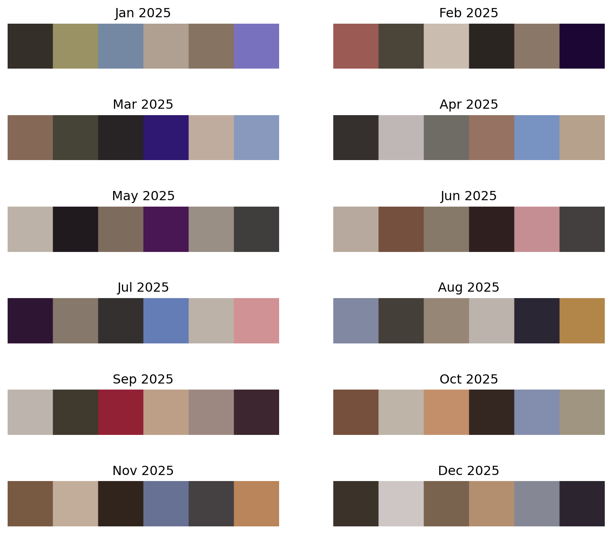

# Introduction

While learning about classification machine learning methods during my time in UCSB's MEDS program, an idea formed in my head that relates colors and the photos I take. If I can extract the colors from each individual photo in my library, it would be cool to see a vibrant color palette which represents my entire camera roll.

To get started, these are the libraries used in this project.

```{python}
import osxphotos
from PIL import Image as PILImage
import datetime as dt
import numpy as np
import pandas as pd
from colorthief import ColorThief
import math
import matplotlib.pyplot as plt
from sklearn.cluster import KMeans
from skimage import color
import plotly.graph_objects as go
import os
```

## `osxphotos` Python Library

First, we extract our photos into a Python object. The photos I take from my phone are synced to my photos on my computer through iCloud and are stored in a special path on MacOS systems. The `osxphotos` library was used to access this path on my computer and store all my photos and their metadata into a special `osxphotos` object, essentially a large list with each entry being one photo.

```{python}
# Retrive photos library from system path
photosdb = osxphotos.PhotosDB()

# Begin Jan 1, 2024
start = dt.datetime(2024, 1, 1)
# End Mar 31, 2026
end = dt.datetime(2026, 3, 31)

# Extract photo items, restrict dates
photos = photosdb.photos(from_date=start, to_date=end)
```

# Filtering

Now that there's a list of all my photos, I want to only include photos that my camera has taken. As part of the metadata for each photo, there are boolean tags indicating the type of media (screenshots, videos, etc). We can write a simple function that will be applied to every photo in our list and return it or not based on the media type.

**Exclude**:

- Screenshots
- Videos
- Saved pictures from online

```{python}
#| code-fold: true

def photo_filter(photo): 
    # Exclude screenshots
    if photo.screenshot:
        return False
    # Exclude movies
    if photo.ismovie:
        return False
    # Exclude saved photos
    if photo.exif_info.aperture is None:
        return False
    
    return True
```

Since the `photos` object is a list, a simple for loop can apply the filtering function.

```{python}
photos_filtered = [p for p in photos if photo_filter(p)]
```

As of now, photos aren't sorted by date.

```{python}
for photo in photos_filtered[:5]:
    print(f'Date: {photo.date}')
```

# Sorting

```{python}
photos_sorted = sorted(photos_filtered, key=lambda p: p.date)

# Check sort
for photo in photos_sorted[:5]:
    print(f'Date: {photo.date}')
```

# Viewing

To view our photos, we can write another function that uses `PILImage` and will display our photos in a grid. Note that some photos will result in errors and these won't be displayed.

```{python}
#| code-fold: true

def display_valid_photos(photolist, figsize):
    # Initialize valid photo empty list
    valid_photos = []
    valid_idx = []
    # valid_colors = []
    # Initialize photo error count
    err_count = 0

    # Iterate through photos
    for i, photo in enumerate(photolist):
        try:
            valid_photos.append((photo.path, PILImage.open(photo.path)))
            valid_idx.append(i)
        except Exception:
            err_count += 1

    # Plot valid photos
    cols = 8
    rows = math.ceil(len(valid_photos) / cols)
    fig, axes = plt.subplots(rows, cols, figsize=figsize)
    plt.subplots_adjust(hspace=0.8)
    axes = axes.flatten()
    
    for i, (path, img) in enumerate(valid_photos):
        # Photo row
        axes[i].imshow(img)
        axes[i].axis('off')
        axes[i].set_title(f'#{valid_idx[i]}')

        # # Color swatch row
        # color = get_color(path)
        # valid_colors.append(color)
        # swatch = PILImage.new("RGB", (50, 50), color)
        # axes[i * 2 + 1].imshow(swatch)
        # axes[i * 2 + 1].axis('off')

    for ax in axes[len(valid_photos):]:
        ax.axis('off')

    print(f'Error in {err_count} photos.')
```

```{python}
photos_feb26 = [p for p in photos_sorted if ((p.date.year == 2026) & (p.date.month == 2))]
```

```{python}
display_valid_photos(photos_feb26, figsize=(11, 24))
```

# Color Extracting

Now that we can successfully view our photos, we can start extracting colors! The Python library `colortheif` will be used for the extracting and can return the RBG values of a photo's dominant color. To test this, I pick four photos with obvious dominant colors to make sure the extracted color is accurate.

Photos:

- June 12, 2024, Hydrangea (green/purple)
- March 15, 2025, Illenium concert (purple-ish)
- December 12, 2025, Maks beach (blue)
- December 21, 2025, Japan fall colors (orange)

To streamline picking out singular photos, I write another function that greatly reduces the amount of photos to go through when looking for one.

```{python}
#| code-fold: true
def photo_pick(photolist, date_str, photo_position = None, exact = False):
    datetime = dt.datetime.strptime(date_str, "%Y-%m-%d")
    year_input = datetime.year
    month_input = datetime.month
    day_input = datetime.day

    if exact:
        photo_day = [p for p in photolist if ((p.date.year == year_input) & (p.date.month == month_input) & (p.date.day == day_input))]

        photo_exact = photo_day[photo_position - 1]
        return photo_exact
    else:
        photo_day = [p for p in photolist if ((p.date.year == year_input) & (p.date.month == month_input) & (p.date.day == day_input))]

        return photo_day

```


```{python}
jun12 = photo_pick(photos_sorted, "2024-6-12", exact=False)
photo1 = photo_pick(photos_sorted, "2024-6-12", photo_position=23, exact=True)

mar15 = photo_pick(photos_sorted, "2025-3-15", exact=False)
photo2 = photo_pick(photos_sorted, "2025-3-15", photo_position=6, exact=True)

dec12 = photo_pick(photos_sorted, "2025-12-12", exact=False)
photo3 = photo_pick(photos_sorted, "2025-12-12", photo_position=5, exact=True)

dec21 = photo_pick(photos_sorted, "2025-12-21", exact=False)
photo4 = photo_pick(photos_sorted, "2025-12-21", photo_position=3, exact=True)
```

```{python}
test_photos = [photo1, photo2, photo3, photo4]
```

```{python}
#| code-fold: true
def get_color(image_path):
    ct = ColorThief(image_path)
    return ct.get_color()

def display_photo_colors(photolist, figsize):
    # Initialize valid photo empty list
    valid_photos = []
    valid_idx = []
    valid_colors = []
    # Initialize photo error count
    err_count = 0

    # Iterate through photos
    for i, photo in enumerate(photolist):
        try:
            valid_photos.append((photo.path, PILImage.open(photo.path)))
            valid_idx.append(i)
        except Exception:
            err_count += 1

    # Plot valid photos
    cols = 2
    rows = len(valid_photos)
    fig, axes = plt.subplots(rows, cols, figsize=figsize)
    axes = axes.flatten()
    
    for i, (path, img) in enumerate(valid_photos):
        # Photo row
        axes[i * 2].imshow(img)
        axes[i * 2].axis('off')
        axes[i * 2].set_title(f'#{valid_idx[i]}')

        # Color swatch row
        color = get_color(path)
        valid_colors.append(color)
        swatch = PILImage.new("RGB", (50, 50), color)
        axes[i * 2 + 1].imshow(swatch)
        axes[i * 2 + 1].set_title(f'RGB: {valid_colors[i]}')
        axes[i * 2 + 1].axis('off')

    for ax in axes[len(valid_photos):]:
        ax.axis('off')

    print(f'Error in {err_count} photos.')
```

```{python}
display_photo_colors(test_photos, figsize=(6,10))
```

This looks good! The extracted colors seem to be accurate and we can continue this on bigger photo lists.

# K-means Palette Generation

While thinking about how to "aggregate" colors, I thought the K-means clustering algorithm could be useful. If I can plot my colors onto a 2-D plane, we can set an amount of clusters such that the centroid of each cluster will be the aggregate color. I'll an example plot later to show what this looks like.

```{python}
#| code-fold: true
def extract_colors(photolist):
        # Initialize valid photo empty list
    valid_photos = []
    valid_colors = []
    # Initialize photo error count
    err_count = 0

    # Iterate through photos
    for photo in photolist:
        try:
            valid_photos.append((photo.path, PILImage.open(photo.path)))
        except Exception:
            err_count += 1

    for i, (path, img) in enumerate(valid_photos):
        # Color swatch row
        color = get_color(path)
        valid_colors.append(color)
    return valid_colors
```

```{python}
feb_colors = extract_colors(photos_feb26)
```

One thing worth mentioning before utilizing K-means Clustering is the format our color data is extracted into. In the function above, we return `valid_colors`, basically a list of RGB values for the dominant color of each photo. The RGB color format doesn't quite work for our purposes for a couple reasons. Instead, we convert RGB values to LAB format which are more suited for the algorithm.

```{python}
#| code-fold: true

def aggregate_palette(rgb_colors, n=6, plot=False):
    arr = np.array(rgb_colors, dtype=float) / 255.0
    lab = color.rgb2lab(arr.reshape(-1, 1, 3)).reshape(-1, 3)
    
    km = KMeans(n_clusters=n, random_state=42, n_init=10)
    km.fit(lab)
    
    # Convert centroids back to RGB
    centroids_lab = km.cluster_centers_.reshape(-1, 1, 3)
    centroids_rgb = (color.lab2rgb(centroids_lab).reshape(-1, 3) * 255).astype(int)

    if plot:
        point_colors = arr[np.arange(len(arr))]  # original RGB (0-1) for scatter color
        centroid_colors = color.lab2rgb(centroids_lab).reshape(-1, 3)

        fig, ax = plt.subplots(figsize=(9, 7))

        # Normalize L* (0–100) to a reasonable point size range
        L = lab[:, 0]
        sizes = ((L / 100) * 80) + 10  # maps L* to ~10–90px

        # Plot all points, colored by their actual RGB value
        ax.scatter(
            lab[:, 1], lab[:, 2], s=sizes,  # a, b, L axes
            c=point_colors, alpha=0.8, label='colors'
        )

        # Plot centroids as large stars
        centers = km.cluster_centers_
        L_c = centers[:, 0]
        sizes_c = ((L_c / 100) * 300) + 50
        ax.scatter(
            centers[:, 1], centers[:, 2], s=sizes_c,
            c=centroid_colors, marker='*',
            edgecolors='black', linewidths=0.2, label='centroids'
        )
        ax.set_xlabel('a* (green–red)')
        ax.set_ylabel('b* (blue–yellow)')
        ax.set_title(f'LAB color space — {n} clusters')
        ax.legend()

    return [tuple(c) for c in centroids_rgb]
```

```{python}
feb_palette = aggregate_palette(feb_colors, n=6, plot=True)
```

Here we see the clustering algorithm in action. I chose 6 clusters for this set of photos. Using a similar method as before, we can go through color of each centroid and display a color swatch.

```{python}
fig, ax = plt.subplots(1, 1)
swatch = PILImage.new("RGB", (300, 50))
for i, c in enumerate(feb_palette):
    swatch.paste(PILImage.new("RGB", (50, 50), c), (i * 50, 0))

ax.imshow(swatch)
ax.axis('off')
ax.set_title("Feb. 2026 Aggregated Palette")
plt.show()
```


# Iterating Through All 2025 Months

```{python}
#| eval: false
fig, axes = plt.subplots(6, 2, figsize=(10, 9))
months = ['Jan', 'Feb', 'Mar', 'Apr', 'May', 'Jun', 'Jul', 'Aug', 'Sep', 'Oct', 'Nov', 'Dec']
for i, mo in enumerate(months):
    photos_monthly = [p for p in photos_sorted if (p.date.year == 2025) & (p.date.month == i + 1)]
    colors_monthly = extract_colors(photos_monthly)
    palette_monthly = aggregate_palette(colors_monthly, n=6, plot=False)

    swatch = PILImage.new("RGB", (300, 50))
    for j, c in enumerate(palette_monthly):
        swatch.paste(PILImage.new("RGB", (50, 50), c), (j * 50, 0))
    
    row, col = i // 2, i % 2
    axes[row, col].imshow(swatch)
    axes[row, col].axis('off')
    axes[row, col].set_title(f'{mo} 2025')

plt.show()
```



# All Photo Colors in 3D Space

```{python}
# long run time
# all_colors = extract_colors(photos_sorted)

# save to csv instead & load in
all_colors = pd.read_csv("all_colors.csv")
all_colors_arr = all_colors[['r', 'g', 'b']].values
```

```{python}
# convert to RGB 0-1
arr_n = np.array(all_colors_arr, dtype = float) / 255.0
```

```{python}
lab = color.rgb2lab(arr_n)
```

```{python}
l_star = lab[:, 0]
a_star = lab[:, 1]
b_star = lab[:, 2]
point_colors = arr_n[np.arange(len(arr_n))]
```

```{python}
fig = go.Figure(data=[go.Scatter3d(
    x=a_star, y=b_star, z=l_star,
    mode='markers',
    marker=dict(color=point_colors, size=2)
)])

fig.update_layout(scene=dict(
    xaxis_title="a* (green-red)",
    yaxis_title="b* (blue-yellow)",
    zaxis_title="L* lightness"
))

fig.show()
```